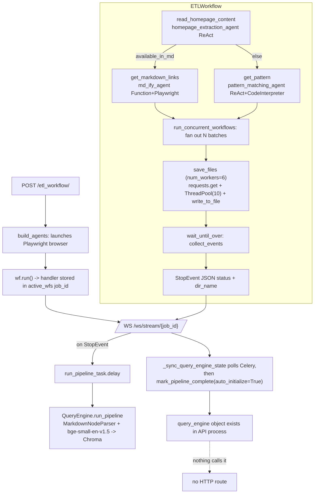

# Phase 1 — Codebase Comprehension

**Repo:** `github.com/Sno3mahn/OmniDoc_Search` @ `898c703` ("Add files via upload") — a single commit, no history to learn from.
**Scope:** 874 lines of Python across 11 files. Every file read in full, including all of `import_stuff/`.
**Verification:** claims about LlamaIndex runtime semantics below were checked by executing against `llama-index-core` 0.14.24 in a scratch environment, not inferred. The repo pins nothing (see "What isn't in the repo"), so the installed version may differ from the author's.

---

## 1. What the repo actually contains

| File | Lines | Role |
|---|---|---|
| `api.py` | 115 | FastAPI: `/health_check`, `POST /etl_workflow/`, `WS /ws/stream/{job_id}` |
| `run_workflow.py` | 211 | `ETLWorkflow` (5 steps) + argparse CLI |
| `agentic_etl.py` | 90 | Agent factory + `Event` class definitions |
| `rag_qe.py` | 137 | `QueryEngine` singleton (Chroma + ingestion + query engine) |
| `tasks.py` | 31 | Celery app + `run_pipeline_task` |
| `import_stuff/prompts.py` | 94 | 3 system prompts |
| `import_stuff/utils.py` | 87 | `run_concurrent_workflows`, `run_agent_verbose`, `write_to_file`, `extract_page_content` |
| `import_stuff/tools.py` | 34 | `extract_page_content`, `get_html_body` |
| `import_stuff/rag_pipeline.py` | 72 | `qe_tool` — an older, parallel RAG implementation |
| `import_stuff/__init__.py` | 3 | re-exports |
| `__init__.py` | 0 | — |

**What isn't in the repo:** no `requirements.txt` / `pyproject.toml` / lockfile, no README, no `.env.example`, no Dockerfile or compose file, no tests, no CI. `.gitignore` is the stock GitHub Python template. There is nothing that documents how to start the API, the Celery worker, or Redis, and nothing that pins the LlamaIndex version the code was written against — which matters, because several bugs below are version-sensitive.

---

## 2. The intended flow (as drawn by the code)



The dotted edge is the headline Phase 1 finding.

---

## 3. End-to-end trace

**1. `POST /etl_workflow/`** (`api.py:45`) reads `homepage_url` from the JSON body, mints a `uuid4` job id, and calls `build_agents(use_playwright=True)` — which launches a **fresh headless Chromium per request** (`agentic_etl.py:35`). It constructs `ETLWorkflow(timeout=None)`, calls `wf.run()` (non-blocking — returns a handler and schedules the workflow on the API's event loop), stores `{'handler': handler}` in the module-level `active_wfs` dict, and returns the job id.

The `finally:` block on `api.py:64-66` then closes the Playwright browser — **immediately**, while the workflow it was built for has barely started. The CLI path in `run_workflow.py:186-198` gets this right (`await wf.run()` before closing); the API path does not.

**2. `read_homepage_content`** (`run_workflow.py:29`) derives `dir_name` from a regex on the URL (`somesite` → `somesite_dir`), then hands a long inline instruction to `homepage_extraction_agent` and does `json.loads(str(res))` on the raw agent reply — no fence-stripping, no try/except. It stores `available_in_md`, `list_of_contents`, `file_name_map` and branches to `MDifyEvent` or `AnalyseTextEvent`.

Note the prompt conflict: `HOMEPAGE_EXTRACTION_PROMPT` (`prompts.py:31`) specifies a two-key JSON schema (`list_of_contents`, `available_in_md`), while the inline query asks for a third key `file_name_map`. The system prompt also says "Final output must be **only** this JSON", so the agent is being told two different schemas at once. `file_name_map` is what supplies every output filename downstream, so when the agent honours the system prompt, `file_name` resolves to `''` and `write_to_file` writes to the directory path itself.

**3a. Markdown branch — `get_markdown_links`** (`run_workflow.py:80`): asks `md_ify_agent` to resolve each doc URL to a raw markdown URL, `json.loads` again, then `html_to_md = html_to_md if html_to_md else list_of_contents` (line 103) — which substitutes a **list** where a dict is expected. Calls `run_concurrent_workflows(..., source_found=..., batch_size=4)`.

**3b. Non-markdown branch — `get_pattern`** (`run_workflow.py:112`): takes `sample(list_of_contents, 3)`, asks `pattern_matching_agent` (which has the code interpreter) to derive and *execute* cleanup Python, and passes the result as `clean_up_code`.

**4. `run_concurrent_workflows`** (`utils.py:13`) computes `num_conc_running_events = ceil(len/batch_size)`, stores it, and fires one `ExtractWebpageEvent` per batch via `ctx.send_event`. Its first line is `await ctx.store.get('html_to_md')` with **no default** — and in the `get_pattern` branch `html_to_md` was never set.

**5. `save_files`** (`run_workflow.py:122`, `num_workers=6`) resolves the URL list, then runs `etl_per_site` across a `ThreadPoolExecutor(max_workers=10)`: `requests.get(site, timeout=15)`, fall back to the HTML URL on non-200, `extract_page_content([site])` (a *second* fetch, via `SimpleWebPageReader`), `write_to_file`. Failures are `print`ed to the server's stdout and go nowhere near the WebSocket. Emits `DirNameEvent`.

**6. `wait_until_over`** (`run_workflow.py:169`) calls `ctx.collect_events(ev, [DirNameEvent] * num_running_events)` and then **`if events is None:` returns the StopEvent** — see §5.

**7. Celery hand-off** happens in `api.py:85-102`, inside the WebSocket handler. On seeing the `StopEvent` it parses the result JSON and, if `dir_name` is set, fires `run_pipeline_task.delay(...)` and spawns `_sync_query_engine_state`.

**8. Ingestion** (`tasks.py:11` → `rag_qe.py:88`): `SimpleDirectoryReader(input_dir)` → filter empty files → `IngestionPipeline([MarkdownNodeParser(), HuggingFaceEmbedding("BAAI/bge-small-en-v1.5")])` → Chroma `PersistentClient(./omnidoc_search.db)`, collection `dt_doc_collection` (a single hardcoded name for every site). Sets `self.pipeline_run = True` **in the Celery worker process**.

**9. `_sync_query_engine_state`** (`api.py:26`) polls `AsyncResult.ready()` in a `while` loop with `await asyncio.sleep(1)` — a blocking Redis call on the API's event loop, with no timeout — then calls `mark_pipeline_complete(auto_initialize=True)` on the **API process's** singleton, which builds `self.query_engine`.

**10. …and that's where it stops.** Nothing queries it.

---

## 4. The headline finding: RAG QA is not exposed

Confirmed by grep across the whole repo. `api.py` registers exactly three routes: `GET /health_check`, `POST /etl_workflow/`, `WS /ws/stream/{job_id}`. `QueryEngine.initialize_query_engine` is reachable only through `mark_pipeline_complete`, called only from `_sync_query_engine_state`. **`self.query_engine.query(...)` is never called anywhere in the codebase**, and no route accepts a user question.

So the "RAG-powered QA interface exposed via FastAPI" in the project description does not exist yet. The ingestion half is real and wired; the retrieval half is a constructed object sitting in memory with no caller. This is a genuine gap to close (a `POST /query` route is ~10 lines), not a search failure on my part.

A second, related gap: `import_stuff/rag_pipeline.py` is a complete parallel implementation of the same thing (`qe_tool`, returning a `QueryEngineTool` for agent use, against a *different* db path `./docu_rag.db`, with delete-and-recreate collection semantics instead of `rag_qe.py`'s reuse semantics). It is exported by `import_stuff/__init__.py:4` and imported nowhere else. It is dead — but importing `import_stuff` still executes it, which is how the `sqlite3` monkey-patch (below) reaches the API process.

---

## 5. Three defects that change what the architecture *does*, not just how well it does it

These belong in Phase 2's list, but they're here because the flow diagram in §2 is the intended flow, and these determine that the executed flow differs.

**(a) `StatusEmitterEvent` cannot be constructed. Verified by execution.**
`agentic_etl.py:89` declares `present_status: str` (required). All ten call sites (`run_workflow.py:58,75,98,106,107,115,118,164,175` and `utils.py:30`) pass `status=`, and `api.py:84` reads `ev.status`. LlamaIndex `Event` routes unknown kwargs into a private dict, so `ev.status` *would* work — but the declared field is still required and missing:

```
ValidationError: 1 validation error for StatusEmitterEvent
present_status  Field required [type=missing, input_value={}]
```

This fires on the **first line of the first step**. As written, no workflow reaches step two, and the WebSocket sees `{"type":"error"}`. Fix is one character-level change: rename the field to `status`, or drop the declaration entirely.

**(b) The `collect_events` guard is inverted.**
`Context.collect_events` returns `None` *until* the expected set is complete, and the list once it is (docstring verified in 0.14.24). `wait_until_over` returns its `StopEvent` inside `if events is None:` — i.e. on the **first** `DirNameEvent`, when N−1 batches are still running — and returns nothing when the set is actually complete. The workflow therefore terminates early and the `len(os.listdir(dir_name)) == len(list_of_contents)` check runs against a half-written directory, so the result is almost always the `partial success` string. Worse, Celery ingestion is triggered off that early StopEvent, so it indexes whatever files happen to exist at that instant.

**(c) In the markdown branch, every batch re-does the whole job.**
`run_concurrent_workflows` sends `send_to_event(html_to_md=batch_of_md_dict, source_found=...)` without `list_of_contents` (`utils.py:34`). `save_files` sees `ev.list_of_contents == []` → falsy → falls back to `ctx.store.get("list_of_contents")`, the **full** list, then `if html_to_md:` overwrites it with `list(html_to_md.values())` from the **store-level** dict — also the full set. The per-batch dict is computed and discarded. Result: N parallel `save_files` invocations each fetching all M URLs — N×M requests instead of M, against a docs site, from a 10-thread pool each. The non-markdown branch (`utils.py:36`) passes `list_of_contents=batch_of_contents` correctly and does not have this problem.

Two more that are cheap to state: `run_concurrent_workflows`'s first line raises `ValueError` in the non-markdown branch (`ctx.store.get('html_to_md')` with no default, key never set — the raise-on-missing behavior is verified in `workflows/context/state_store.py:418`), and **`clean_up_code` is never read by `save_files`** — the entire `pattern_matching_agent` run, including code-interpreter execution, is computed, streamed, and thrown away.

---

## 6. Agent-dependent vs. deterministic

This is the distinction that matters most for Phase 2, because the agent-dependent surface has no schema validation anywhere.

**Correctness depends on an LLM returning well-formed output:**

| Site | Depends on | Failure mode if the LLM misbehaves |
|---|---|---|
| `run_workflow.py:66` | `homepage_extraction_agent` emits bare JSON, no fences, no prose | Unhandled `JSONDecodeError`, workflow dies |
| same | that JSON contains `file_name_map` (contradicted by its own system prompt) | Every file written with `file_name=''` |
| same | `list_of_contents` entries are absolute, real, doc-only URLs | Silent 404s / off-site fetches |
| same | `available_in_md` is judged correctly | Wrong branch taken; no recovery path back |
| `run_workflow.py:100` | `md_ify_agent` emits bare JSON with a **dict** under `html_to_md` | `JSONDecodeError`, or a list where a dict is expected → `AttributeError` on `.keys()` at `utils.py:32` |
| same | raw URLs are real and not hallucinated | Non-200 → URL silently skipped, no user-visible signal |
| `run_workflow.py:117` | `pattern_matching_agent` returns valid Python | Irrelevant — output is discarded (§5) |
| `run_workflow.py:137` | LLM-supplied filenames are safe | `os.path.join(dir_name, file_name)` with LLM input = path traversal |

**Deterministic:** the regex `dir_name` derivation, batching arithmetic, the `requests.get` + `ThreadPoolExecutor` fetch loop, `write_to_file`, the entire ingestion path (`SimpleDirectoryReader` → `MarkdownNodeParser` → embeddings → Chroma), and Celery dispatch. The retrieval half — if it were wired up — is deterministic apart from the answer synthesis itself.

The shape of it: **every branch decision and every URL in the pipeline is LLM-produced and unvalidated, while everything downstream that consumes them assumes they're well-formed.** There is not one `try`/`except` around a `json.loads`, and not one schema check (LlamaIndex's `structured_output` / a Pydantic output schema would remove most of this class of failure outright).

---

## 7. Process-wide side effects and state (noted here, unpacked in Phase 2)

- **`sys.modules['sqlite3'] = pysqlite3`** at `rag_qe.py:16-17` *and* `import_stuff/rag_pipeline.py:19-20`. Because `import_stuff/__init__.py` imports `rag_pipeline`, this patch executes on any import of `import_stuff` — which means the FastAPI process, the CLI, and the Celery worker all get their `sqlite3` swapped as a side effect of an unrelated import.
- **`QueryEngine` is a process-wide singleton** with no key on collection/db. Two ingestions with different collection names in one process reconfigure the same object; `pipeline_run` is a per-process boolean, and it is set in the Celery worker while it is *read* in the API process (hence `mark_pipeline_complete` existing at all — it's a manual cross-process flag sync).
- **`active_wfs`** is a module-level dict: lost on restart, not shared across Uvicorn workers, `del`eted in a `finally` (so a second WS connect to the same id, or an early failure, raises `KeyError`), and leaked forever if a client never connects.
- **Ingestion is a side effect of someone watching.** The Celery dispatch lives inside the WebSocket handler, so a job whose client never connects — or disconnects before `StopEvent` — completes the ETL and is never indexed.
- **`api.py:17-18`** declares module globals `dir_name` and `homepage_url` that are never read; both names are shadowed by locals at their use sites.
- **`import socketio`** (`run_workflow.py:16`) and the commented-out socket.io scaffolding in `api.py:22-23` are leftovers from a previous transport.
- **`extract_page_content` is defined twice**, identically, in `tools.py:7` and `utils.py:79`. `__init__.py` exports the `tools.py` one.

---

## 8. Unverified / unclear — needs a runtime or an answer from you

1. **LlamaIndex version.** Nothing is pinned. I verified §5(a) and §5(b) against 0.14.24. If the author ran an older `llama_index.core.workflow` where `Event` handled required fields differently, (a) may not reproduce — though the field-name mismatch is a defect either way. **Do you know which version this was developed against?**
2. **Has this pipeline ever completed end-to-end?** Given §5(a), I can't see how it could have on this commit. If you've seen it produce a populated `*_dir/`, then either the version differs or there's uncommitted local work.
3. **CWD coupling.** `dir_name` is relative, produced by the API process and consumed by the Celery worker as `input_dir`. Whether they share a working directory is a deployment fact, not a code fact — unverifiable from the repo (no Dockerfile, no run script).
4. **Redis / Celery topology.** `redis://localhost:6379/0` is hardcoded in `tasks.py:6-7`. Prefork vs. solo pool matters for the singleton and for the HF embedding model's memory footprint.
5. **Whether `handler.stream_events()` replays buffered events.** The workflow starts at `POST` time; the WS may attach seconds later. LlamaIndex queues stream events, so early ones *should* be delivered — but I have not confirmed this against a running workflow, and it determines whether the first two status messages ever reach a client.
6. **Playwright's actual contribution.** Only `md_ify_agent` receives the Playwright tools, and it also has `extract_page_content`. Whether the agent ever chooses the browser tools over the cheap fetch is an empirical question about model behavior.
7. **`file_name_map` in practice.** Whether real agent runs emit it despite the system prompt not asking for it — needs a live run to settle.
8. **`bge-small-en-v1.5` download.** First `HuggingFaceEmbedding(...)` call pulls the model from HF; in a sandboxed worker with no egress this fails at ingestion time. Unknown for the target environment.
9. **Auth / deployment surface.** No auth, no CORS config, no rate limiting on any route. Whether that's intentional for a demo is a scope question for you.

---

## Phase status

| Phase | Status |
|---|---|
| 1 — Codebase comprehension | **delivered** |
| 2 — Edge cases, fixes, optimizations | not started |
| 3 — Scale plan (1k/10k/100k) | not started |
| 4 — Frontend | not started |
| 5 — Video scripts | not started |
